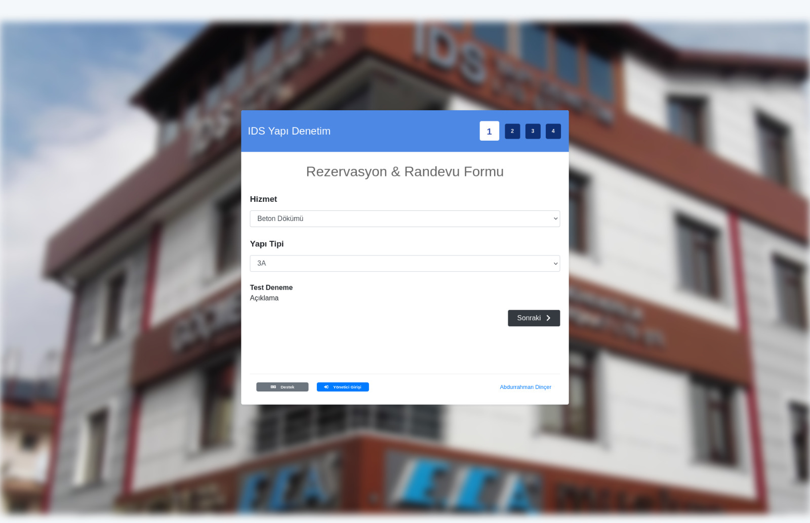
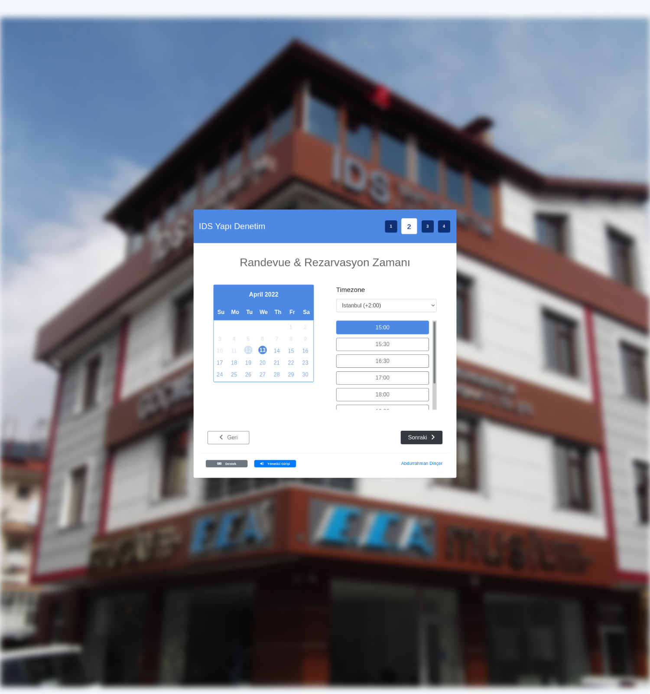

# Paketler

- **Paket 1:** 3000tl radnevu formu gonderilir. Formlar yapi denetim firmasinin epostasina gonderilir. Sadece eposta ile ilgili kisiye bildirim gonderilir. Herhangi bir sms onayi veya kontrolu bulunmamaktadir.
- **Paket 2:** 6000tl randevu formu gonderilir. Gonderilen formlar yapi denetimin yonetim sayfasinda goruntulenir ve onaylanir. Sadece eposta ile ilgili kisiye bildirim gonderilir.
- **Paket 3:** 10000tl randevu zamanlari randevu formu gonderilir. Form gonderen kisiden sms onayi istenir. Web sitesi uzerinden onay ve reddedilmesi durumunda basvuru sahibine sms ve eposta gonderilir.
- **Paket 4:** 12000tl randevu formu gonderilir. Form gonderen kisiden sms onayi istenir. Web sitesi uzerinden onay ve reddedilmesi durumunda basvuru sahibine sms ve eposta gonderilir. Yapidenetim firmasi takvim uzerinden randevu takibi yapabilir, basvuru sahibine ozel sms gonderebilir, randevu planini yeniden duzenleyebilir.

> \*Tüm paketlerde yapıdenetim firmasının talebi üzerine ücretsiz olarak kendi subdomainine kaydı yapılabilmektedir. https://randevu.idsyapidenetim.com

`Not: Sonraki seviyelerde harita üzerinden görüntüleme, raporlamalar, istatistikler, yapayzeka ile zaman önerileri vesaire olabilir lakin bu kısımların yapımı için ekstra maliyet ve iş gücü gerekmektedir. Bu özelliklerin sisteme dahil olduğu bir paket sunulmamıştır.`

# Kosul ve Sozlesmeler

- Sms koşulları:
  Ücretsiz 1000 sms tanımlanacaktir. Her yıl ücretsiz 1000 sms kullanım hakkı sıfırlanacak.
  Aşım olmaası durumunda her 100 sms icin 5tl lik paket yüklenmis olur.

- Sistem yurutme masraflari:
  Her bir yapıdenetım hesabı için gunumuz kurunda yıllık 417tl lik bir odeme gerekmektedir. Bu fiyat natro xcloud mini paketinin fiyatini baz alarak yarısı olacak sekilde belirlenecektir.
  not: https://www.natro.com/sunucu-kiralama/vps-cloud-server xcloud mini paketi yillik kdv dahil 835tl. Yapıdenetim basina 417tl odeme gerekecektir.

- Sözleşme süresi:
  Sözleşme durumuna gore değişiklik gösterebileceği gibi 5 yıl boyunca fiyatlandırma politikası aynı kalacaktır.

- Yürütme ve destek cayma hakkı:
  Egerki sistem bizden harici olarak yurutulmesi istenilirse projelerin derlenmiş hali ile satın alan firmaya teslim edilecektir.

# Ornek Sablon

Sayfa 1             |  Sayfa 2
:-------------------------:|:-------------------------:
  |  
